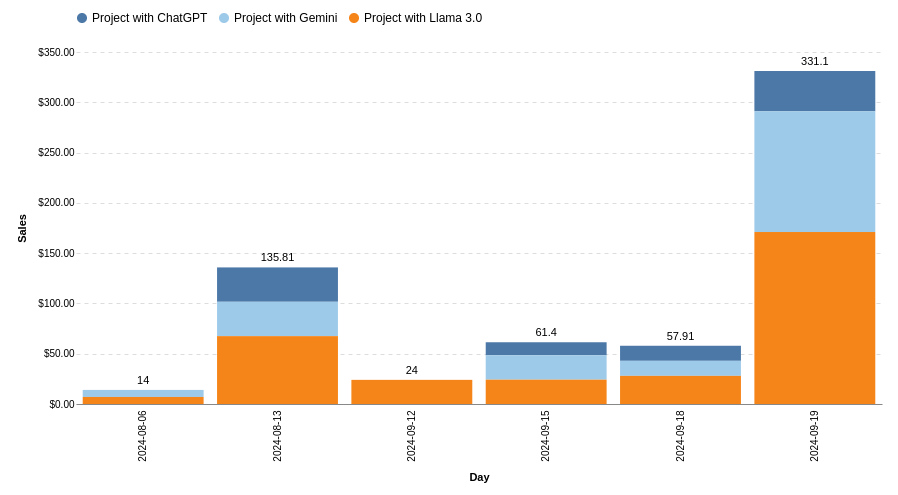
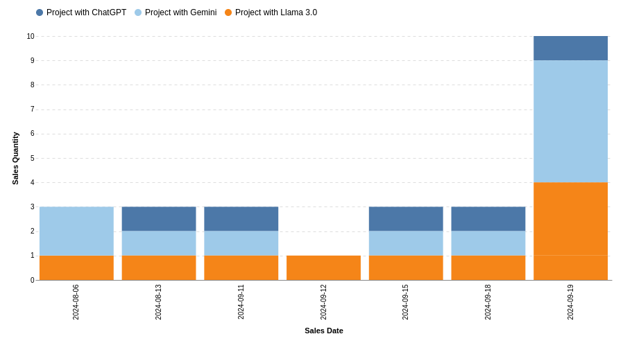
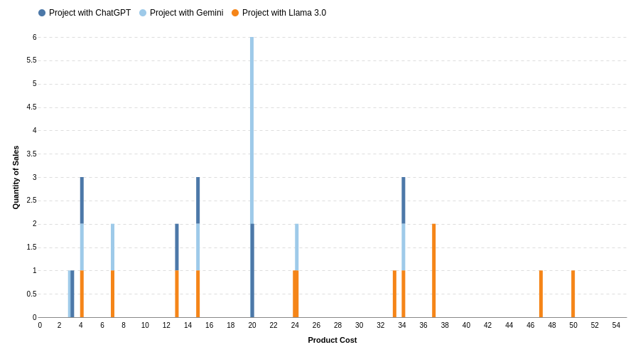
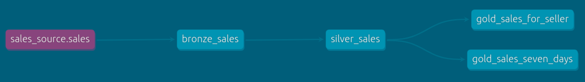

# Project:

Criação de uma plataforma de CRM, onde são inseridos os dados da venda, onde então são enviados para um banco de dados hospedado na Render.


## Avaliable at:

* Project website: https://pipeline-ai.streamlit.app/
* Project documentation: https://jeperico.github.io/crm-sales/


## Briefer

To install _Briefer_ in your Python project:
```
pip install briefer
```
To run _Briefer_:

```
briefer
```

### The charts done with _Briefer_:
> Money per Day:


> Sales Quantity per Product:


> Sales Quantity per Cost:



## Stack:
Technologies that I'm using in this project:

* ***Briefer***: Notebook that transform data into dashboards.
* ***DBT***: See this topic bellow.
* ***Postgres***: The database used.
* ***Render***: The open source host to database.
* ***AWS***: The not open source host to database.
* ***Makefile***: Used to do prompt shortcuts.

### Dbt:

Dbt is used to do a medallion architecture that clean the data into db views:


* ***Raw***: The origin data, all the db register;
* ***Bronze***: The first version of medallion, where contains all data;
* ***Silver***: The layer where clean all the wrong data;
* ***Gold Sales for Seller***: A totally cleaned view to get the sales data for a specific seller;
* ***Gold Sales Seven days***: A totally cleaned view to get the last seven days sales data;
